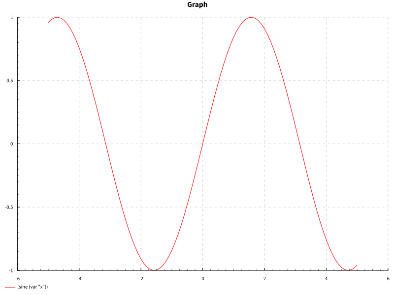
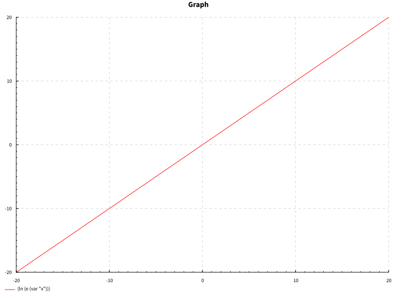

# Custom Math Library

This is a custom math library written in Haskell that can be used to encode mathematical expressions so that they can be simplified, evaluated, or even partially differentiated. The library also includes some handy tools for all your calculus midterm studying needs! 

## Getting Started
You'll find the different aspects of the math library split up into neatly contained modules. These include: ```ExprType.hs``` for the skeleton of mathematical expressions, ```ExprDiff.hs``` for the nitty-gritty of the mathematical functions, ```ExprParser.hs``` for parsing strings into mathematical expressions that can be operated on by the library, and ```ExprTest.hs``` for testing of the mathematical library.

### Prerequisites

What things you need to install the software and how to install them

```
TBA
```

### Installing

TBA

## Mathematical Expressions

The following mathematical functions are encoded in the library:
```haskell
(Const 64.0)                          -- Encodes a constant as a Float or Double

(Var "x")                             -- Encodes a variable as a String

(Parens (Expression))                 -- Wraps an expression in parantheses

(Add (Expression) (Expression))       -- Adds two expressions together

(Expression) !+ (Expression)          -- Infix notation for addition

(Subtr (Expression) (Expression))     -- The difference of two expressions

((Expression) !- (Expression))        -- Infix notation for subtraction

(Mult (Expression) (Expression))      -- Multiplies two expressions together

((Expression) !* (Expression))        -- Infix notation for multiplication

(Div (Expression) (Expression))       -- Divides two expressions (denominator cannot equal zero)

((Expression !/ (Expression))         -- Infix notation for division

(Sin (Expression))                    -- Applies an expression to the sine function

(Cos (Expression))                    -- Applies an expression to the cosine function

(Tan (Expression))                    -- Applies an expression to the tangent function

(Exp (Expression))                    -- Applies an expression to the natural exponential function

(Log (Expression))                    -- Applies an expression to the natural logarithm function

(Power (Expression) (Expression))     -- Applies an expression to an exponent of another expression

((Expression) !^ (Expression))        -- Infix notation for powers
```
### Core Functionality
The two core functions of the library are `simplify` and `eval`. The functions take the same two parameters:
  * A Map of variables to their corresponding values (if you wish to substitute) in a tuple. The Math.fromList function can be used to   convert a list of these tuples to a Map:
  ```haskell
  (Map.fromList [("x", 19), ("y", 98)]) -- Variable "x" will be given a value of 19 and "y" a value of 98
  
  (Map.fromList []) -- If we do not wish to substitute any variables
  ```
  * An encoded mathematical expression:
  ```haskell
  -- An expression representing the polynomial 9x^2 + 8x + 2
  ((Add (Mult (Const 9) (Mult (Var "x") (Var "x"))) (Add (Mult (Const 8) (Var "x")) (Const 2))))
  
  -- The same expression using infix notation
  (((Const 9)) !* (((Var "x")) !* ((Var "x")))) !+ ((((Const 8)) !* ((Var "x"))) !+ ((Const 2)))
  
  -- The same expression using infix notation with powers
  (((Const 9) !* (Var "x")) !^ (Const 2)) !+ ((Const 8) !* (Var "x")) !+ (Const 2)
  ```
  
  #### Simplify
  Simplify tries to reduce a mathematical expression as much as possible. You can pass it values to substitute for its variables should you wish to do so. This means simplify reduces an expression and keeps it as an encoded mathematical expression:
```haskell
simplify (Map.fromList []) ((Var "x")  !+ (Var "y") !+ (Const 2) !+ (Const 3))
>>> (((var "x")) !+ ((var "y"))) !+ ((val 5.0))

simplify (Map.fromList [("y", 5)]) ((Var "x")  !+ (Var "y") !+ (Const 2) !+ (Const 3))
>>> ((var "x")) !+ ((val 10.0))
```

 #### Eval
  Eval computes a mathematical expression and returns the value as a native Double or Float. You must pass it values to substitute for all its encoded variables should the expression have any. This means eval solves and decodes a mathematical expression:
```haskell
eval (Map.fromList [("x", 5), ("y", 10.5)]) ((Var "x")  !+ (Var "y") !+ (Const 2) !+ (Const 3))
>>> 20.5

eval (Map.fromList [("x", 5)]) ((Var "x")  !+ (Var "y") !+ (Const 2) !+ (Const 3))
>>> *** Exception: failed lookup in eval
```

### Parsing
  The file `ExprParser.hs` has functions to allow you to parse a string into an encoded mathematical expression.
  The following are supported strings that can be parsed and how they will be translated into the encoded mathematical expression:
  ```haskell
  "2" >> (Const 2) -- Numbers will be converted to Floats or Doubles depending on the parser used
  "x" >> (Var "x") -- Variables must start with letters or _
  "2 + x" >> (Add (Const 2) (Var "x")) -- Whitespace is ignored
  "(2+x)" >> (Parens (Add (Const 2) (Var "x")))
  "5.5 - 10.3" >> (Subtr (Const 5.5) (Const 10.3))
  "y * -5.5" >> (Mult (Var "y") (Const (-5.5)))
  "x / y" >> (Div (Var "x") (Var "y"))
  "sin(x)" >> (Sin (Var "x")) -- input MUST be wrapped in parantheses, no whitespace between paranthesis and function
  "cos(5 + -3)" >> (Cos (Add (Const 5) (Const (-3))))
  "tan(x)" >> (Tan (Var "x"))
  "e^(x)" >> (Exp (Var "x"))
  "ln(ln(x))" >> (Log (Log (Var "x")))
  "2*x ^ 2" >> (Mult (Const 2) (Power (Var "x") (Const 2)))
  "(2*x)^2" >> (Power (Parens (Mult (Const 2) (Var "x"))) (Const 2))
  "2 + 5 * -3" >> (Add (Const 2) (Parens (Mult (Const 5) (Const (-3))))) -- BEDMAS is observed
  ```
#### parseExprD
Parses a string into the encoded mathematical form, converting the numbers to Doubles:
```haskell
parseExprD "2 + -0.999999999999999"
>>> ((val 2.0)) !+ ((val -0.999999999999999))
```
#### parseExprF
Parses a string into the encoded mathematical form, converting the numbers to Floats:
```haskell
parseExprF "2 + -0.999999999999999"
>>> ((val 2.0)) !+ ((val -1.0))
```

## Partial Diffentiation
The function `partDiff` takes two arguments: 
1. A string of the variable to which respect is given
2. The expression to be differentiated.
```haskell
partDiff "x" (Div (Const 1) (Var "x"))
>>> ((val -1.0)) !/ (((var "x")) !* ((var "x")))

partDiff "x" (Mult (Var "x") (Var "y"))
>>> (var "y")
```

## Combining Functions
To harness the real power of this library, one should remember that the values of functions can be piped into other functions. The notation `$` is really useful here:
```haskell
-- Find the slope of the function f(x) = 1/x at f(2)
eval (Map.fromList [("x", 2)]) $ partDiff "x" $ parseExprD "1/x"
>>> -0.25
```
## Bonus Features
### Sigma Sum
The file `ExprBonus.hs` includes the function `sigma` which takes 4 arguments and performs a sigma sum:
1. The independent variable
2. The first value of the variable in the sigma sum 
3. The last value of the variable in the sigma sum 
4. The encoded mathematical expression to be summed

```haskell
sigma "i" 1 100 $ parseExprD "i"
>>> (val 5050.0)

sigma "i" 1 100 $ parseExprD "i^2"
>>> (val 338350.0)

sigma "i" 1 100 $ parseExprD "i + i^2"
>>> (val 343400.0)

sigma "i" 100 100 $ parseExprD "i^2"
>>> (val 10000.0)

sigma "i" 100 1 $ parseExprD "i^2"
>>> (val 0.0)
```
### Series Convergence
The file `ExprBonus.hs` includes the function `isConverging` which takes 3 arguments and tries to determine if a series converges as the independent variable approaches infinity:
1. The independent variable
2. The starting position of the series (ensure this is defined!)
3. The encoded mathematical expression

```haskell
isConverging "x" 1 $ parseExprD "1/x"
>>> False

isConverging "x" 1 $ parseExprD "10^10 / x"
>>> False

isConverging "x" 1 $ parseExprD "1/x^2"
>>> True

isConverging "x" 1 $ parseExprD "1/x^1.1"
>>> True

isConverging "x" 1 $ parseExprD "ln(x)"
>>> False

isConverging "x" (-1) $ parseExprD "ln(x)"
>>> *** Exception: Log is undefined on this domain!
```
*Note: Determining whether a series converges using this type of computation is an undecidable problem. As such, isConverging only returns True when a series converges faster than the series 1 / x^1.1.*

### Integrals
The file `ExprBonus.hs` includes the function `integral` which takes 5 arguments and returns the value of the integral on a given range using the Trapezoidal Rule:
1. The variable to which respect is given
2. The left bound of the integral
3. The right bound of the integral
4. The number of trapezoids
5. The encoded mathematical expression

```haskell
integral "x" 0 10 20 $ parseExprD "x^2"
>>> (val 308.75)

integral "x" 0 10 1000 $ parseExprD "x^2"
>>> (val 333.8334999999903)

integral "x" 0 10 100000 $ parseExprD "x^2"
>>> (val 333.3383333496896)

integral "x" 10 0 100000 $ parseExprD "x^2"
>>> (val -333.3383333496896)

integral "x" 10 10 100000 $ parseExprD "x^2"
>>> (val 0.0)

integral "x" (-10) 10 100 $ parseExprD "x^3"
>>> (val -5.775291356258095e-12)
```

### Newton's Method
The file `ExprBonus.hs` includes the function `newton` which takes 4 arguments and returns an estimate of where a root lies on a function:
1. The independent variable
2. The initial guess of where the root is
3. The maximum recursion limit (how many times to run before giving up)
4. The encoded mathematical expression

```haskell
newton "x" 1 100 $ parseExprD "3*x^2 + 4*x - 5"
>>> (val 0.7862996478468912)

newton "x" 10 100 $ parseExprD "x*e^(x^2)"
>>> *** Exception: Newton's Method was unable to find a root after the maximum number of iterations allowed using the given initial guess. Please make a more accurate guess or increase the maximum recursion limit and try again.

newton "x" 0 100 $ parseExprD "1/x"
>>> *** Exception: The denominator equals zero!

newton "x" (-5) 100 $ parseExprD "ln(x)"
>>> *** Exception: Log is undefined on this domain!

newton "x" 3 100 $ parseExprD "(x-3)^2"
>>> *** Exception: The deriative at this point is 0!
```

#### Pure Newton's Method
The file `ExprBonus.hs` includes the function `pureNewton` which takes the same 4 arguments as `newton`, except returns the solution in a Maybe type, where either a solution is given or Nothing is returned. *Note: basic arithemetic exceptions such as a divide by zero error are still thrown*:

```haskell
pureNewton "x" 1 100 $ parseExprD "3*x^2 + 4*x - 5"
>>> Just (val 0.7862996478468912)

pureNewton "x" 10 100 $ parseExprD "x*e^(x^2)"
>>> Nothing

newton "x" 3 100 $ parseExprD "(x-3)^2"
>>> Nothing
```

### Fix Floating Point Error
The file `ExprBonus.hs` includes the function `fixFloatingError` which takes an encoded constant number and returns the number rounded to six decimal places:

```haskell
fixFloatingError (Const (-3.0000000000000004))
>>> (val -3.0)
```

### Critical Points
The file `ExprBonus.hs` includes the function `criticalPoints` which takes 4 arguments and returns a list of the defined critical points of a function: *Note: undefined critical points are not returned*
1. The independent variable
2. The left value of the domain
3. The right value of the domain
4. The encoded mathematical expression

```haskell
criticalPoints "x" (-20) 20 $ parseExprD "(x-2)^2 + 4"
>>> [(val 2.0)]

 criticalPoints "x" (-20) 20 $ parseExprD "5*x^3 + 10*(x-3)^2 - 4"
>>> [(val 1.441518),(val -2.774852)]

criticalPoints "x" (-2*pi) (2*pi) $ parseExprD "sin(x)"
>>> [(val 4.712389),(val 10.995574),(val 1.570796),(val -1.570796),(val -4.712389)]
```

### Extrema
The file `ExprBonus.hs` includes the function `extrema` which takes the same 4 arguments as `criticalPoints` and returns a list of coordinates of the local maxima and minima of a function:

```haskell
extrema "x" (-20) 20 $ parseExprD "(x-2)^2 + 4"
>>> [("Local Minimum",(2.0,4.0))]

 extrema "x" (-20) 20 $ parseExprD "5*x^3 + 10*(x-3)^2 - 4"
>>> [("Local Maximum",(-2.774852,222.660079)),("Local Minimum",(1.441518,35.265847))]

extrema "x" (-2*pi) (2*pi) $ parseExprD "sin(x)"
>>> [("Local Maximum",(-4.712389,1.0)),("Local Minimum",(-1.570796,-1.0)),("Local Maximum",(1.570796,1.0)),("Local Minimum",(10.995574,-1.0)),("Local Minimum",(4.712389,-1.0))]
```


### Graphing
The file `ExprGraphing.hs` includes the function `graph` which takes 4 arguments:
1. The variable to which respect is given 
2. The left value of the domain 
3. The right value of the domain 
4. The encoded mathematical expression to be plotted

The function produces an HTML file called graph.HTML in the same directory as `ExprGraphing.hs` that can be opened to reveal the function plotted on its domain in SVG graphics!

```haskell 
graph "x" (-5) (5) $ parseExprD "sin(x)"
```
This code yields the following graph in an HTML page:


```haskell
graph "x" (-20) (20) $ parseExprD "ln(e^(x))"
```
Likewise, this code yields:


## Built With

* [Parsec Expr](https://hackage.haskell.org/package/parsec-3.1.13.0/docs/Text-Parsec-Expr.html) - The parsing framework

## Versioning

TBA

## Authors

* **Jack Buckley** - [bucklj4](https://github.com/bucklj4)

## License

This project is licensed under the MIT License - see the [LICENSE.md](LICENSE.md) file for details

## Acknowledgments

* [Jake Wheat's Intro to Parsing](https://jakewheat.github.io/intro_to_parsing/)
* [Curtis D'Alves's skeleton files](http://www.cas.mcmaster.ca/~dalvescb/#outline-container-orga8f4fcc)
